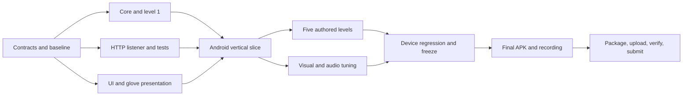

# Tower Prototype — same-day delivery plan

Status: implementation underway; G2 remains PARTIAL, with image-directed fidelity correction required now. Codex owns planning, prioritization, and milestone review; Claude owns implementation and integration. The candidate owns device access and final submission.

The [immutable brief](../Reference/Unity-technical-test/Unity-technical-test.md), [image](../Reference/Unity-technical-test/attachments/ref.png), and [video](../Reference/Unity-technical-test/attachments/ref.mp4) remain authoritative. This document contains implementation decisions and assumptions, not amendments to that brief.

## Immediate priority — updated 2026-09-28

Follow [CURRENT_FIDELITY_REVIEW.md](CURRENT_FIDELITY_REVIEW.md) now. The candidate identifies the **preview image as the visual target**, with the video's different copy used only as secondary motion/event context. This decision supersedes prior video-based palette/framing choices and the elapsed schedule's automatic five-level expansion instruction.

Current direction: **parallel level implementation cancelled by the user; gameplay will change.** Defer campaign/configuration work and integration until revised gameplay is specified. The cancelled campaign worktrees and branches were removed at the user’s request; do not resume the discarded design automatically.

Work already present: licensed presentation, distance-driven pose driver, eased knockback/re-grip, paused/reset level clock, effect-disable cleanup and a meaningful nonzero-height retry test. Saved XML verifies 25/25 passing tests; the latest recorded build succeeded. These are retained progress, not visual acceptance. Only one level configuration exists. Device lose/retry, audible impact and remaining lifecycle/session checks stay open. See the linked review for evidence and limits.

| Order | Current work | Required evidence |
| --- | --- | --- |
| 1 — still delivered, awaiting review | G2 image fidelity: pale tower, bright sky, compact character lower in frame, outlined yellow HUD | Corrected portrait device still compared directly with ref.png: `evidence/fid_device_vs_ref.png` (APK `cff0462f…`). Candidate feedback and Codex review pending. |
| 2 — next, after still feedback | G2 climbing feel and device closure | Visible grip/pull/recovery; webhook clip; audible impact; lose/retry and pause checks. |
| Deferred by user | G3 level implementation awaits revised gameplay | Campaign worktrees removed; no merge, execution or acceptance claimed. |
| 4 — delivery | G4 complete candidate → G5 regression → G6 recording/package → G7 submission | Build-linked validation, final recording, APK/project/README and verified delivery link. |

| Checkpoint | Current acceptance |
| --- | --- |
| G2 | Image-directed device still and convincing climb/contact/recovery clip reviewed; audible impact and device lose/retry verified; existing Android/webhook requirements retained. |
| G3 | Exactly five difficulty variations sharing visuals, reached sequentially and completable on Android; progression, retry, final completion and remaining lifecycle/session checks verified. |

The schedule below is the original baseline. Missed target times do not imply completion; the priority order above controls current work. Re-estimate remaining gates after the first corrected still, keeping the submission target and required scope visible.

## 1. Delivery target and priorities

Planning date: **September 28, 2026**. All schedule times below use **Recife, UTC−03:00**.

- User's deadline: **09:00 UTC**, interpreted as **September 29 at 06:00 Recife**, since today's 09:00 UTC had already passed when the deadline was supplied. Confirm the date during kickoff without delaying independent work.
- Internal submission target: **September 28 at 22:00 Recife / September 29 at 01:00 UTC**. This leaves eight hours before the interpreted hard deadline.
- Start implementation around **07:45 Recife**. If starting later, use the reduction rules below; do not move the final packaging work to the last hour.
- Device versus emulator has not been confirmed. Resolve it in the first 15 minutes and match the APK architecture to the actual test target.
- **No generated art, textures, models, sprites, sound, or music.** Use existing free assets. Importing, assembling, recoloring materials, configuring UI, and animating imported objects are implementation work. Do not introduce an image-generation service, procedural art pipeline, custom modeling task, or audio synthesis task.

Protect these outcomes: installable Android APK; exactly five distinct, completable levels; working touch controls and menus; real GET and POST `/bump` requests producing a full-screen glove event; continued play afterward; APK recording; complete project and README.

Visual fidelity, gameplay feel, and the webhook account for 70% of the brief's score. Spend the available polish time on tower composition, climbing motion, camera behavior, and the glove impact. Reserve delivery time from the beginning.

## 2. Evidence and proposed game

### What was inspected

The project is a largely empty URP template: Unity **6000.3.11f1**, URP **17.3.0**, Input System **1.19.0**, uGUI **2.0.0**, Test Framework **1.6.0**, and Pipeline **0.8.0-exp.1** are already present. `SampleScene` contains a camera, light, and volume; no gameplay scripts or runtime UI were found. Android Player, SDK, NDK, and OpenJDK directories exist. A build and deployment have **not** been verified.

A running Editor was discovered, but its Pipeline server was not reachable from the planning session. Safe Mode was not detected. Diagnose connectivity/permissions before assuming the package is missing; do not reinstall or upgrade dependencies speculatively. Git exists, with the project files currently untracked; preserve all existing work when establishing a baseline.

The screenshot shows a light cylindrical tower, repeated rings/windows, cyan clouded sky, a small orange-clothed character, a left altitude meter, and large outlined HUD text. The **103.21-second, 576×1080, 30 FPS** video shows a more ornate tower, upward climbing, large interruptions, dramatic camera pullbacks, and a game-over screen. Visual inspection used samples across the full clip plus one-second samples of its opening; Claude should play the opening and impact sequence with audio at kickoff. An audio track is present; its content has not been audited here.

| Reference interval | Observed behavior to preserve |
| --- | --- |
| Approximately 0–8 s | Character grips the tower and cycles limbs; vertical progress is readable while the camera follows. |
| Approximately 9 s | Many red boxing gloves and bright impacts cover much of the playfield. |
| Approximately 25–80 s | Large spectacle effects and camera-distance changes interrupt the climb. |
| Approximately 85–103 s | Further knockback/impact sequences and a game-over overlay. |

Input bindings, five-level structure, obstacle rules, and exact failure rules cannot be established from the samples. Do not describe the following design assumptions as observed reference behavior.

### Implementation decisions

**Gameplay validation pending:** see [REFERENCE_BEHAVIOR_REVIEW.md](REFERENCE_BEHAVIOR_REVIEW.md). Input, obstacle-band, and three-mistake rules below are provisional proposals, not verified reference mechanics. The ending includes countdown/trophy imagery before GAME OVER, so that label alone does not establish defeat. Resolve the control/failure interpretation before implementing those rules for G2; Android/webhook proof can proceed independently.

1. Use **3D imported models with constrained vertical gameplay**, the existing URP renderer, and a fixed-azimuth camera following height. Start with a modest perspective camera. Match tower/character screen proportions before adding detail.
2. Use **portrait on Android** as the delivery adaptation, with **ref.png as the art-direction baseline**: pale tower with blue window details, bright cyan clouded sky, compact climber lower in frame, and bold outlined yellow/red HUD. Adapt relative proportions to portrait; do not import the video copy's palette or centered composition as the visual target.
3. **Hold to climb; release to cling/idle.** Provide a large bottom touch region and Space/W for Editor testing through the installed Input System. Keep menu touches out of gameplay input. Reset held input on pause, focus loss, death, and level changes.
4. Add simple, telegraphed obstacle bands along the climb: wait below an active band, then climb through its safe interval. These are proposed playable obstacles, not a claim about unseen reference controls. One reusable hazard behavior is enough.
5. Use **three mistakes per attempt** as the initial failure rule. Normal hazards cause a short hit/fall, reduce height, and consume one mistake. Reaching the summit wins. Give clear remaining-attempt feedback. Tune this after the first playable pass.
6. The webhook produces a **nonlethal** interruption with small, clamped downward displacement and automatic re-grip. It must always permit continued play; do not let it consume the final attempt or leave the character detached.
7. One authored gameplay scene, one player prefab, one camera rig, one UI root, and **five explicit level configurations**. Loading a level reuses the shared environment, replaces hazards and resets state. Five scenes are unnecessary.
8. Use uGUI for menus, HUD, and the glove overlay. Implement main menu, sequential levels 1–5, pause/resume, retry current, win/next, final completion, lose/retry, and return-to-menu. No separate level-select screen or visual variation is required (candidate clarification).

Record these assumptions in the final README. Do not reproduce the reference's streaming integrations, recognizable licensed characters, trucks, creatures, or unrelated spectacle systems. The required boxing event provides the spectacle for this scope.

## 3. Existing assets only

Limit initial selection/import to **45 minutes**, including a visible import check. Import only needed files and preserve licenses. Source-page checks occurred on September 28; the Blocky Characters and Castle Kit archives were also inspected. An imported Unity rendering test remains necessary.

| Need | Selected source | Evidence and implementation choice |
| --- | --- | --- |
| Character | [Kenney Blocky Characters](https://kenney.nl/assets/blocky-characters) | CC0. Archive contains FBX models and 27 animations per character. Choose one readable silhouette; prefer an orange-clothed option if available. |
| Tower | [Kenney Castle Kit](https://kenney.nl/assets/castle-kit) | CC0. Archive contains `tower-base.fbx`, `tower-top.fbx`, and modular variants. Preview of `tower-base` shows a cylindrical body with rings: stack and scale this imported piece, then use a pale material tint. |
| Sky | [Kenney Skyboxes](https://kenney.nl/assets/skyboxes) | Source page lists CC0 sky textures. Choose a blue/clouded sky; avoid a custom sky shader. |
| Boxing glove | [Lorc's boxing glove](https://game-icons.net/1x1/lorc/boxing-glove.html) | Source page states CC BY 3.0 and provides an existing [transparent white PNG](https://game-icons.net/icons/ffffff/transparent/1x1/lorc/boxing-glove.png). Tint red in UI and outline with a slightly larger dark duplicate. Credit Lorc, source, license, and tint/outline adaptation. |
| Hit/climb/UI audio | [Kenney Impact Sounds](https://kenney.nl/assets/impact-sounds) | CC0. Choose a soft impact, a short movement sound, and one suitable confirmation sound. Listen before importing; distinguish gameplay sounds from music/speech in the reference. |
| UI art | [Kenney UI Pack](https://kenney.nl/assets/ui-pack) | CC0. Use a small selection of existing button/panel sprites. Prefer an already supplied, licensed font; record its actual source/license. |

**Animation risk:** the inspected character archive includes `idle`, `walk`, `sprint`, `die`, interaction, holding, and emote clips, but **no named climb clip**. Do not schedule a retargeting search. Budget 30–45 minutes for a small runtime pose driver on the imported rig: hands toward the tower, alternating arm/leg motion, slight body bob. Use existing `die`/emote clips where they fit. One component owns each animated transform; avoid Animator/pose-driver contention. This creates behavior on an existing model, not new source artwork.

Use the downloaded glove even if a 3D glove would look better. Animate six large copies across the screen. A readable glove silhouette and good timing are more valuable than spending hours looking for a perfect model.

No asset from the reference image/video is licensed for extraction by the brief; keep those files as reference material. No paid purchases or generated substitutes. If an asset fails import, use another file/format from the same selected pack before opening a new search. Keep asset acquisition and license decisions in Claude's lead lane; other lanes receive fixed asset paths.

## 4. Schedule and review gates

Times are target completion times, not permission to wait. Move directly to the next task when evidence is ready. A missed gate triggers scope reduction and a revised estimate. The parallel column describes opportunities, not a requirement to launch agents. Under the Pro-plan default below, Claude executes the coding lanes sequentially while builds/downloads, candidate device work, and Codex review overlap. The schedule is a delivery target, not a guarantee of sufficient subscription quota.

| Recife, Sep 28 | Work | Parallel opportunity | Required evidence / gate |
| --- | --- | --- | --- |
| 07:45–08:15 | Kickoff: inspect reference with audio, confirm device and deadline date, preserve baseline, verify Editor connection, set contracts/folder owners. Start Android build setup. | Asset-source verification and README inventory can run while the Editor checks complete. | **G0:** target device identified; architecture chosen; implementation contracts fixed. |
| 08:15–09:15 | Install a small smoke APK with a minimal real listener; import selected art and establish tower/character scale. | Core lead assembles scene/build; webhook lane supplies listener; presentation lane prepares view scripts against contracts. | **G1:** APK installs/launches; a PC GET and POST each visibly change an in-app diagnostic counter through the phone's listener. This is an infrastructure proof, not final `/bump` acceptance. |
| 09:15–11:30 | Build one full playable level: climbing, camera, hazards, win/lose/retry. Connect first glove effect and minimal menus. | Gameplay, webhook hardening, and UI/VFX proceed independently, then integrate in short batches. | **G2:** vertical slice runs on Android with touch; menu → level → hit/recovery → win/retry; actual request triggers six gloves and play resumes. |
| 11:30–13:30 | Author the other four level configurations; complete all menus; stabilize transitions, pause, and webhook lifecycle. | Lead owns level data and scene wiring; webhook lane tests transport; presentation lane finishes HUD/audio. | **G3:** all five difficulty variations sequentially reachable and completable on Android; both HTTP verbs work; no required feature remains a placeholder. |
| 13:30–16:00 | Tune movement, pacing, tower silhouette/materials, climb pose, HUD, hit readability, camera shake, and SFX. Compare device screenshots with reference. | Presentation tuning can overlap gameplay tuning in separate files. Device/Editor usage is scheduled, not concurrent. | **G4:** complete candidate APK; five-level completion matrix; readable impact/recovery; no missing materials or known blockers. Feature freeze. |
| 16:00–18:00 | Device regression, targeted tests, lifecycle/rapid-request checks, performance pass, documentation and license audit. Fix blockers only. | README/package inventory and code review can run while device checks execute. | **G5:** release candidate accepted with evidence. Preserve its APK and source revision. |
| 18:00–20:00 | Record final APK: menu, all five levels played/completed, real webhook trigger, continued play. Recheck install from the final artifact. Prepare clean project archive. | Recording and documentation can overlap; no code changes during a take. | **G6:** watchable recording, installable APK, reproducible project, README, complete license records. |
| 20:00–22:00 | Upload, verify downloads/access from the single submission link, resolve packaging problems, submit. | Only packaging/checks; implementation is closed except delivery blockers. | **G7:** candidate submits the verified link before 22:00. |

The eight-hour hard-deadline buffer is for exceptional build/upload problems and rest, not planned feature work.

## 5. Parallel work and ownership

**Current exception cancelled:** the candidate stopped the Sol campaign worktree assignment pending gameplay changes. No campaign agents remain active.

**Pro-plan default: one active Claude Code implementation session using Sonnet.** Execute the three logical workstreams sequentially, integrating a minimal version of each for the first Android slice. Codex remains the planner/reviewer; the candidate handles device playtesting and final submission. Keep the existing Codex model/effort assignment, but limit its work to focused reviews and blockers.

The ownership table below also documents how work could be split. Do not launch a standing three-agent team. Only consider **one short, bounded worker** after measured usage shows headroom and the task is independent enough to save time. Follow existing role/model instructions if delegating. A worker uses the same Claude subscription allowance, not an additional allocation.

| Lane | Owner and files | Work that can start after G0 | Must not edit |
| --- | --- | --- | --- |
| A — Core and integration | Claude lead: `Assets/Game/Core/`, `Gameplay/`, `Levels/`, `Scenes/`, `Prefabs/`, `Editor/`; shared contracts; project/package settings; asset import | State machine, motion, input, camera, level data, scene composition, Android builds, integration | Other workers' owned source files without coordinated handoff |
| B — Webhook | Claude lead by default; optional bounded worker: `Assets/Game/Webhook/`, its owned tests, proposed webhook documentation | Plain C# listener/parser, bounded request handoff, HTTP tests, shutdown/restart behavior; requires no art or scene | When delegated: shared contracts, player state, scenes, UI, package/settings files |
| C — Presentation | Claude lead by default; optional bounded worker: `Assets/Game/Presentation/`, its owned tests, UI construction helper source | HUD/menu view logic, six-glove animation, SFX playback, imported-rig pose behavior | When delegated: player movement/state, level configurations, listener, shared scenes, asset imports/settings |

Only the lead mutates the shared Editor, imports assets, creates/changes serialized scene/prefab/configuration files, runs play-mode/build/test sessions, or changes packages. Workers supply focused scripts and wiring instructions. Have them explicitly acknowledge that others are editing the project and that they must preserve unrelated changes. Avoid workers independently creating bootstrap systems, global event buses, or duplicate HUDs.

Define the small contracts before branching:

| Contract | Decision |
| --- | --- |
| `GameSession` | Owns menu/playing/paused/won/lost state, level instance ID, start/retry/next, and accepted hit transitions. |
| `LevelDefinition` | Contains stable ID 1–5, finish height, climb speed, and explicit ordered hazard placements/timings; visuals are shared. Validate exactly five at startup. |
| `PlayerMotor` | Sole owner of gameplay position/height. Exposes climb intent, normalized progress, and clamped hit displacement; presentation never writes its root transform. |
| `BumpRequest` | Plain data carrying request ID and the active level instance ID captured at acceptance. No Unity object crosses threads. |
| Bump dispatch | Session validates request on the main thread, applies nonlethal hit through the motor, and invokes presentation once. Discard stale level IDs. |
| Presentation | Consumes snapshots/events; emits menu/input intents. Camera shake uses a child offset and cannot replace the follow target's position. |

Prefer direct serialized references and a few C# events. One runtime assembly is enough initially; add a small test assembly where needed. No DI framework, ECS, Addressables migration, multiplayer stack, or generalized ability system.



The critical path is **Android transport proof → playable Android slice → five completed levels → final APK validation → recording and submission**. Builds, scene integration, and device control are serialized bottlenecks. More agents will not shorten those steps.

### Subscription budget check

Checked against official documentation on September 28, 2026. Account balances and reset times have not been supplied, so quota fit is **unverified**. The two products' Pro labels do not indicate equivalent allowances.

- [Claude Pro](https://support.claude.com/en/articles/8325606-what-is-the-pro-plan) has five-hour session limits and a weekly limit. [Claude and Claude Code share allowance](https://support.claude.com/en/articles/11145838-use-claude-code-with-your-pro-or-max-plan). A session reset does not refill an exhausted weekly allowance.
- [Claude's usage guidance](https://code.claude.com/docs/en/costs) confirms that subagents also consume usage and recommends Sonnet for most coding. Check `/usage` or Settings → Usage; a displayed API-equivalent dollar estimate is not the remaining Pro allowance.
- [Codex pricing and limits](https://learn.chatgpt.com/docs/pricing) distinguishes Pro 5× and 20×, with model/task-dependent consumption and possible weekly limits. Check its usage dashboard or CLI `/status`. Do not infer a project budget from a message-count estimate.

Before G0, record both accounts' remaining session/weekly allowances and reset times in STATUS. If unavailable, stay single-session and treat quota as a material delivery risk. Neither upgrades nor paid overflow are part of this plan.

Measure usage again after G1 and G2. Use the observed allowance consumed, remaining required work, and actual resets to reassess the schedule; do not assume one prompt equals one unit or extrapolate an exact completion cost from a small sample. Aim to preserve roughly 30% of available allowance for debugging and final fixes; this is a planning reserve, not a provider limit.

Claude should read the brief/plan once per necessary context, work from focused tasks, inspect only relevant files, and save logs to files with concise failure summaries. Batch related source edits and Editor operations. Avoid broad repository rescans, repeated plan generation, constant screenshot polling, and duplicate whole-project reviews. At a clean milestone, save status and artifact paths before starting a fresh task context; compaction/clearing does not reset subscription quota.

Useful overlap without extra Claude agents: the candidate tests an existing APK or prepares recording/upload while Claude works on the next bounded task; Codex reviews a fixed source revision while Claude works on unaffected files; downloads/builds run while documentation is prepared. Coordinate access to the Editor/device and keep artifact versions explicit.

If a limit is near, protect required fixes and delivery ahead of polish. While blocked on a reset, the candidate can playtest, record an already accepted APK, and prepare submission; Codex can review existing work. Do not assume switching sessions/models bypasses a shared cap. If the next reset threatens delivery, report that immediately and revise scope/timing without silently switching to paid usage or changing Codex's implementation role.

## 6. Implementation acceptance details

### Climbing, camera, and levels

Keep the character visibly attached to the tower. Use one constrained motion calculation with explicit obstacle detection across the previous-to-next height interval; do not depend on a discrete overlap check that skips a band on a slow frame. Avoid full rigidbody climbing, IK systems, and physics joints for this deadline. Separate logical height from displayed height so the reference's large altitude labels do not require a physically enormous scene.

Start with comfortable **30–50-second clean runs**, then tune actual playthrough times. Each level must differ in authored obstacles/timing, not only its name or tint. All hazards must allow a safe wait location and a crossing interval; no unavoidable spawn hit.

| Level | Distinct authored progression | Expected demonstration |
| --- | --- | --- |
| 1 — First ascent | Short tower; one generous, clearly signaled obstacle band after a safe opening. | Learn hold/release, reach summit, see win state. |
| 2 — Higher climb | Taller tower; two separated bands with different phases. | Two intentional waits; visible increase in height. |
| 3 — Rhythm | Three bands with alternating active windows; safe rest spaces. | Read a repeated timing pattern. |
| 4 — Pressure | A close pair with a safe gap, then a recovery section and final band. | Plan a short sequence; recover cleanly from a normal hit. |
| 5 — Summit | Recombine established patterns in a longer final ascent with a clear finish crown. | Complete a distinct final challenge and return to level select/menu. |

Use the same architecture/material family across all five. Change heights, spacing, crown pieces, and subtle sky/material tint rather than sourcing five art themes. Maintain reference proportions and keep HUD legible at phone size.

Hit/recovery must be deterministic: briefly interrupt climbing, move down a bounded distance, re-grip, and restore input. Normal hazard re-entry has a short invulnerability period. Retry/new level clears hazards, animation offsets, held input, camera offsets, and transient state. Pause freezes gameplay; resume cannot produce a stuck input or delayed volley of old requests.

### Webhook and full-screen event

Prefer a **minimal `TcpListener`** for the first proof, given the tiny endpoint scope. A small HTTP parser must read through the header terminator, handle split packets, limit header/body size, and use timeouts. Support normal `curl` GET/POST requests; reject unsupported encodings/methods promptly instead of hanging. Return a valid response with a body length and close the connection. Do not build a general HTTP server.

- Listener runs inside both the Editor player loop and the APK on device-local port **56789**. Verify `localhost` and IPv4 loopback behavior on the target; do not expose it on all network interfaces by default.
- Network work uses a background thread/task and a bounded queue. It never calls Unity APIs. Session state/acceptance is resolved on the main thread, with a timeout if the app is suspended.
- Successful GET or POST `/bump` while playing returns success after the main-thread acceptance decision. Exact status/body are local design choices: use `200` with a request ID and acceptance status for simple evaluator output.
- Every accepted request must cause visible feedback immediately, including while another glove burst is active. Use bounded retrigger/refresh behavior that cannot extend control lock indefinitely. If capacity is exceeded, explicitly reject with `429` instead of silently losing successful requests.
- Menu, paused, won, and lost states should return an explicit non-playing response such as `409`; do not replay those requests when the next level starts. Wrong paths return `404`, wrong methods `405`.
- Stop/dispose sockets on shutdown and Editor play-mode exit. Handle restart, app background/resume, and occupied-port errors without crashing or leaving orphan listeners. Configure Android internet permission through supported project settings and inspect the resulting build.
- On an idle game, start the effect by the next normal main-thread update after acceptance. Six recognizably boxing-glove sprites enter from multiple edges, converge on the character, and recoil over roughly **0.8–1.2 seconds**. Cover the playfield, add a short flash, camera shake, and an impact SFX. Preserve a clear post-impact recovery.
- Do not use a debug key or button as proof that the HTTP path works. Log request ID, acceptance, and effect start for correlation with the device recording.

### Port-forwarding clarification for the README

The brief mentions `adb reverse`, but the server in this task runs **on the Android device**. Android documents [`adb forward`](https://developer.android.com/tools/adb#forwardports) for host-to-device requests; [`adb reverse`](https://developer.android.com/develop/ui/views/layout/webapps/access-local-server) serves the opposite direction. Keep the brief unchanged and explain this distinction in the README, including the reverse command as contextual documentation rather than a setup step.

With Editor Play mode stopped so it does not occupy host port 56789:

```sh
adb devices
adb -s DEVICE_SERIAL forward tcp:56789 tcp:56789
curl --max-time 3 -i http://localhost:56789/bump
curl --max-time 3 -i -X POST http://localhost:56789/bump
adb -s DEVICE_SERIAL forward --remove tcp:56789
```

If Editor and device must both remain active, use host port **56790** for the device mapping: `adb -s DEVICE_SERIAL forward tcp:56790 tcp:56789`, then curl `http://localhost:56790/bump`. The listener inside the APK remains on 56789. Remove that specific mapping afterward.

`adb -s DEVICE_SERIAL reverse tcp:56789 tcp:56789` would route device requests to a host server; it is **not used** for this game's PC-triggered webhook. Also show the valid curl command without the brief's stray angle bracket. Include device selection, launch/start-level steps, forwarding, expected response/effect, and cleanup in the README.

## 7. Tests and overseer checkpoints

At every gate, Claude updates [STATUS.md](STATUS.md) with evidence. To conserve quota, schedule **four Codex reviews: G2 (vertical slice), G3 (five levels), G5 (release candidate), and G6 (submission package)**. Report G0/G1/G4/G7 through brief status updates; escalate a failed Android proof or other blocker immediately. Codex reviews the changed scope, requirement coverage, device evidence, and remaining time. Report **PASS / FAIL / NOT VERIFIED** accurately. A green compilation alone does not pass a gameplay/device gate. Continue unrelated work while a review is pending. The candidate prompts Codex to read the latest status at those checkpoints; this plan does not create automatic cross-app monitoring.

Each handoff should include: gate, source revision or file list, exact APK path, target device/OS/ABI, checks performed/results, screenshot or recording paths, known gaps, next task, and ETA. Escalate a blocker after **15 minutes** with one proposed fallback; keep a transient tooling issue from consuming an hour silently.

| Check | Minimum useful evidence |
| --- | --- |
| Build/deploy | First smoke and final APK install and launch on the selected Android target. Verify actual runtime architecture; installed SDK folders alone are insufficient. |
| Five levels | Per-level start, touch climb, obstacle interaction, summit/win, and next/retry/select transitions on Android. No debug skip as completion evidence. |
| Failure/recovery | A normal lose/retry path; pause/resume and return to menu; a webhook hit near start and near summit that does not soft-lock or kill the attempt. |
| HTTP | GET and POST in Editor and Android; wrong path/method; requests while paused/menu; partial header, disconnected client, repeated requests, occupied port, stop/start. |
| Races | Request at win/retry transition cannot hit the next level; repeated hits do not permanently lock input; background/resume does not replay stale effects. |
| Automated scope | Focused tests for parser edge cases, stale-request rejection, motor bounds/hazard crossing, and session transitions. A small set of meaningful EditMode/PlayMode tests; avoid UI boilerplate tests. |
| Visual/audio | Device screenshots of normal climb and maximum glove coverage; audible impact during play; no pink/missing materials, clipping HUD, or invisible gloves. |
| Performance | Five-minute device session with repeated events and level changes. Target stable 30 FPS minimum, preferably 60; record device and actual result. Check for growing object counts or repeatable stalls. |
| Reference preservation | Run the existing `shasum -a 256 -c SHA256SUMS` from the reference directory. Never regenerate that manifest. |

For test runs, capture executed-test counts and result files. A process exit without executed tests is not a pass. Run tests/builds through the lead's single Editor workflow; avoid concurrent Unity processes opening the same project.

## 8. Time recovery rules

- **No Android transport proof by 09:15:** freeze cosmetic work. Lead and webhook lane fix deployment/listener; presentation can finish independent source work. Keep a minimal visible request counter until transport is proven.
- **No vertical slice by 11:30:** reduce to a single hazard behavior, the imported glove PNG, one fixed camera view plus small shake, and the simplest readable rig pose. Do not expand architecture or switch render pipelines.
- **Five-level expansion:** the original 13:30 target has elapsed. Complete the current G2 image/feel checkpoint first, then immediately author the remaining configurations. Shorten levels and simplify patterns if necessary; retain distinct layouts and clear completion.
- **At 16:00:** feature freeze. Drop optional music if not required by the observed reference, additional VFX, elaborate menu transitions, secondary environments, custom shaders, cloud layers, and extra animation polish before cutting required behavior.
- **At 18:00:** preserve a known-working APK and record it. Any necessary code fix afterward requires rebuilding, retesting affected behavior, and recording the actual replacement artifact.
- **If less than eight hours remain at kickoff:** first 45 minutes prove Android/HTTP; by two hours get one playable level plus gloves; by four hours have five short authored levels and complete menus; reserve at least two hours for final tests, recording, packaging, and upload. This is a higher-risk recovery plan, not an equal-fidelity promise.

Never trade away the real Android webhook, five playable levels, post-hit recovery, asset license records, or the final APK video. Do not use the hard-deadline buffer to justify optional scope.

## 9. Submission package

Produce one submission location containing `TowerPrototype.apk`, `TowerPrototype-demo.mp4`, a clean project ZIP or repository link, and a README. Use a normal installable debug-signed APK; do not plan on an unsigned file installing. Keep build files outside the clean project ZIP, which excludes at least `Library`, `Temp`, `Logs`, `obj`, and build-output folders.

The README covers Unity version, controls, build/open steps, all assumptions above, exactly five levels, each third-party asset actually used with author/license/source, HTTP/ADB instructions, test device/results, and honest known limitations. Exclude unused pack contents from the final import where practical, while keeping required licenses and dependencies.

Record the **final APK on a device or emulator**, showing menu/selection, all five levels played to completion, a real external request and visible glove event, and resumed play. Test the recording method early; if a recorder has duration limits, use clear consecutive segments without omitting level play. Show the curl/request evidence alongside or correlate it through request IDs/timestamps. Never substitute Editor footage for the required APK capture.

Before submission: reinstall the packaged APK, open the actual video, verify the project archive contains Assets/Packages/ProjectSettings and asset licenses, verify the immutable-reference hashes, and test the shared link's access/downloads. The candidate sends the final link after those checks.
