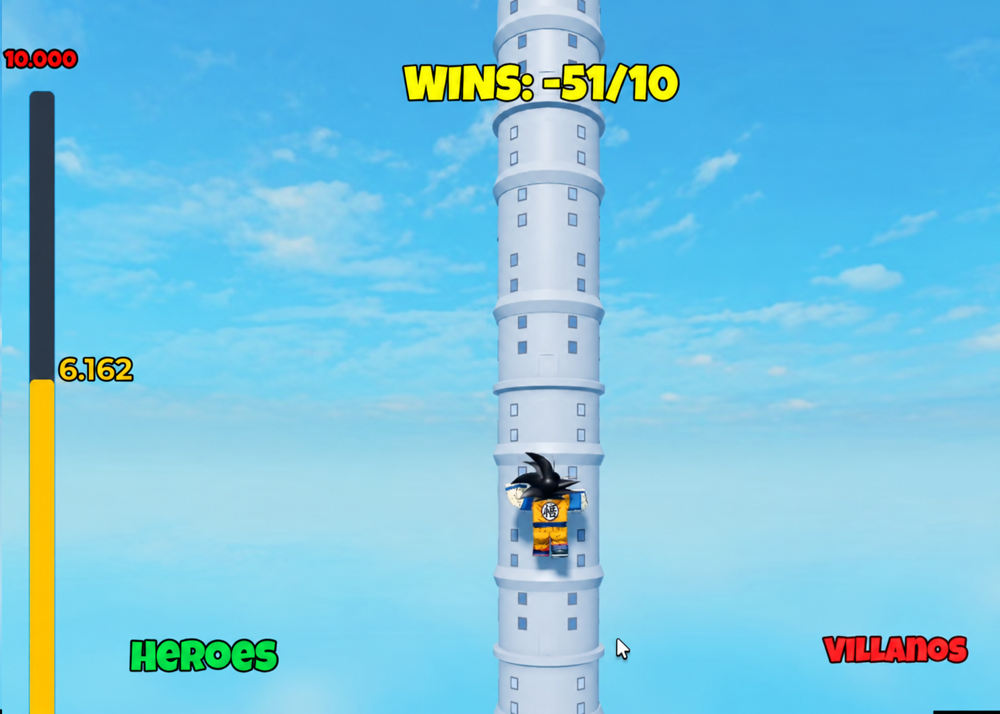

# Unity technical test

## Reference Game Reproduction (Mid/Senior)

> Unpaid technical test — used solely to evaluate hands-on Unity skills for a Mid-level / Senior Game Developer position. Not a paid engagement; no commercial use beyond internal evaluation.

**Time window:** 24 hours, starting once the reference material is received.  
**Cost:** Free / unpaid technical exercise

Reference game: *God Tower*

[ref.mp4](attachments/ref.mp4)

### 1. Overview

You will be given a reference game as screenshots and/or a short video capture. Your task is to reproduce it as closely as possible — visually and in gameplay feel — inside a new Unity project, implementing 5 playable levels, and a webhook-triggered in-game event.

### 2. What you will receive

- A set of reference screenshots and/or a short video recording of the target game (a 2D/2.5D climbing game where a character scales obstacles, reacting to on-screen events).

- This brief.

- The exact webhook contract described in section 5.

### 3. Objective

Recreate the reference game in Unity, matching it as closely as possible on:

- Overall art direction: color palette, silhouette style, background layers/parallax, lighting/shading approach.

- Camera framing and behaviour (follow, zoom, screen shake if present in the reference).

- UI layout: HUD, buttons, fonts/iconography style, menus (main menu, level select, pause, win/lose).

- Core gameplay loop and pacing of the climbing character as seen in the reference video.

Perfect pixel-matching is not expected — the goal is a convincing, professional-quality visual and functional match, not a 1:1 asset clone.

### 4. Required scope

#### 4.1 Levels

- Exactly 5 distinct, playable levels.

- Each level must be completable from start to finish (clear win condition) and must be reachable from a level-select or sequential flow.

- Levels should show visible progression (increasing difficulty, or distinct visual themes) consistent with what's shown in the reference material.

#### 4.2 Character & controls

- A climbing character with controls/mechanics matching the reference as closely as reasonably achievable in the time given.

- Basic states expected: idle, move/climb, fall or hit reaction, win/lose.

#### 4.3 Art & assets — constraints

- Only free-to-use Unity Asset Store / free asset packs (correctly licensed for this use), and/or AI-generated assets (images, sprites, sounds, music) are allowed.

- No help from an associate artist, illustrator, or any third-party human art contributor. All visual asset sourcing/creation must be done by the candidate alone.

- You may use free UI kits, free particle/VFX packs, free SFX libraries, and free fonts, as long as the license permits redistribution in this test.

#### 4.4 Audio

- Basic SFX and/or music are expected if present in the reference; free or AI-generated only, same constraint as above.

### 5. Required feature — Webhook-triggered event

The build must run a local HTTP listener inside the game while playing, exposing:

*POST/GET [http://localhost:56789/bump](http://localhost:56789/bump)*

When this endpoint receives a request while a level is being played, the game must immediately trigger, full-screen and eye-catching:

- A burst of multiple boxing gloves (from any angle/direction, animated, at least 4–6 gloves) striking the climbing character.

- The effect must be clearly visible over the entire screen (not a small local effect) and must read as an obvious, punchy, comedic "hit" moment — think screen shake, impact flashes, glove sprites/particles, and a short SFX.

- The event must not soft-lock or crash the game; after the animation the player must be able to keep playing normally.

#### 5.1 Implementation notes

- The listener can be implemented with `HttpListener`, a minimal `TcpListener`, or any lightweight approach — no external server framework is required.

- It must run on the main thread safely (marshal any request handling back to Unity's main thread before touching GameObjects).

- It should work identically in the Android APK build and in-editor (for testing), listening on `localhost:56789`.

- Document in the README exactly how to trigger it (e.g. curl command) and whether the phone/emulator needs port forwarding (`adb reverse`) to reach localhost from a PC-side curl call — include that command in the README.

*Example trigger for evaluators:* `curl -X POST <http://localhost:56789/bump`>

### 6. Deliverables

1. A playable Android APK (debug or release, unsigned is fine) implementing all 5 levels and the webhook event.

2. A video screen recording (screen capture of the APK running on a device or emulator) showing: main menu, all 5 levels being played/completed, and the webhook event being triggered and visibly reacting on-screen.

3. The full Unity project codebase (Git repository or a clean zipped project, excluding Library/Temp/Build folders), including a README with: engine/editor version used, third-party asset list with license type and source links, and the webhook trigger instructions from section 5.1.

Please share all three via a single link (Git repo + cloud storage link for APK/video, or a single shared drive folder).

### 7. Constraints & allowed tools

- Unity Editor version: any recent LTS (2021 LTS or newer recommended); state your version in the README.

- Assets: free-to-use Unity Asset Store packages, other free/open-license asset packs, and/or AI-generated art/audio only.

- No paid assets, no pirated/unlicensed assets, no human associate-artist contributions.

- You may use AI coding assistants normally, as you would on the job — this is expected and fine.

- Target platform for the deliverable build: Android (APK).

### 8. Evaluation criteria

| Weight | Category | What is being assessed |
| --- | --- | --- |
| 30% | Visual fidelity | How close the 5 levels look/feel to the reference (layout, colors, proportions, camera, lighting, background, UI chrome). |
| 20% | Gameplay feel | Climbing character control, collision, level flow, pacing, and general "juice" matching the reference video. |
| 20% | Webhook feature | Correct, robust implementation of the `/bump` endpoint and the full-screen boxing-glove event. |
| 15% | Code quality | Architecture, readability, use of Unity idioms, scene/prefab organisation, absence of dead code. |
| 10% | Asset integration & performance | Sensible use of free/AI assets, texture/import settings, APK size, stable frame rate on a mid-range device. |
| 5% | Delivery & documentation | APK installs and runs, video is clear, README explains setup/assumptions. |

We are primarily judging how you approach ambiguity, prioritize under a tight deadline, and reproduce someone else's creative direction faithfully and efficiently — not whether you can hand-draw original art.

### 9. Timeline

- The 24-hour window starts when you confirm receipt of the reference screenshots/video.

- Partial/incomplete submissions are accepted at the deadline — submit whatever is functional; do not go silent.

- If you anticipate a blocking technical issue (e.g. environment/build problem unrelated to the exercise itself), flag it to us as early as possible.

### 10. Questions

If any part of the reference material is ambiguous, make a reasonable assumption, implement it, and note the assumption in your README rather than blocking on it — this mirrors real production conditions.

---

*Good luck!*
